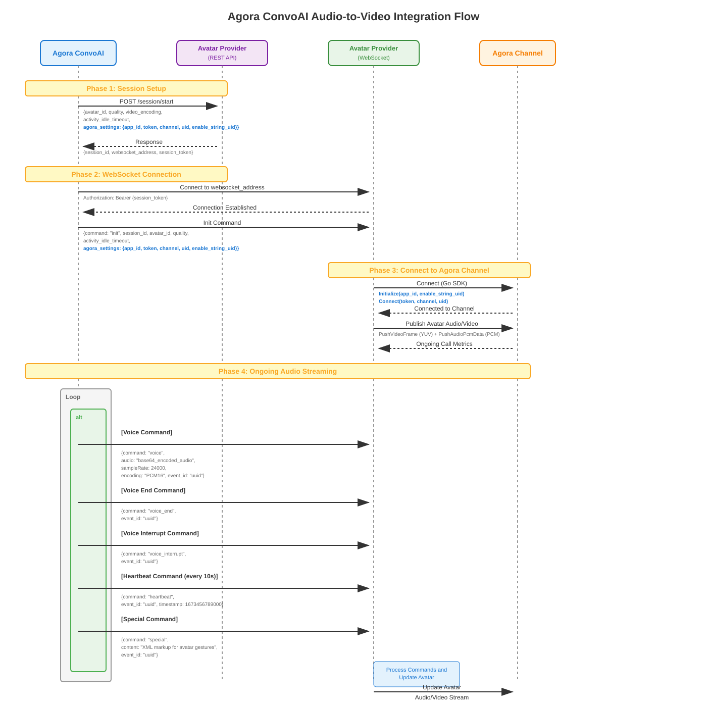

# Agora ConvoAI Agent Speech to Video Integration

This repository provides a protocol and reference implementation for **avatar providers** to integrate with Agora's ConvoAI platform. It enables receiving an AI agent's speech output, generating video (e.g. an animated avatar), and publishing both the audio and video back into an Agora channel for low-latency, global distribution.

## How It Works

1. **Agora calls your REST API** with session parameters (avatar ID, quality, area, Agora channel credentials)
2. **You return a WebSocket address** and session token
3. **Agora streams audio** to your WebSocket — this is the AI agent's speech
4. **You generate video** from the audio (e.g. lip-synced avatar animation)
5. **You publish audio + video** back into the Agora channel using the Go publisher

## Architecture Flow



## Implementation Components

### 1. Connection Setup API — *you implement this*
[connection-setup/](./connection-setup/) — REST endpoints (`POST /session/start`, `DELETE /session/stop`) that Agora calls to establish and tear down sessions. You return a WebSocket address and session token.

### 2. WebSocket Audio Streaming — *you implement this*
[websocket-receive-audio/](./websocket-receive-audio/) — WebSocket server that receives real-time audio from ConvoAI. You process the audio through your video generation pipeline.

### 3. Go Audio/Video Publishing — *use as-is or adapt*
[go-publish-video/](./go-publish-video/) — Publishes YUV video frames and PCM audio into an Agora channel. Feed your generated video and the received audio into this component to push the stream back to users.

## Testing

All components have unit tests that run without Agora credentials or network access.

### Go (IPC, message framing, codec config)
```bash
cd go-publish-video
make test
```

### Python — Connection Setup (session start/stop validation, mock server endpoints)
```bash
cd connection-setup
pip install -r requirements.txt -r requirements-dev.txt
pytest -v
```

### Python — WebSocket (token validation, audio saving, sender/receiver message handling)
```bash
cd websocket-receive-audio
pip install -r requirements.txt -r requirements-dev.txt
pytest -v
```

### End-to-end (requires Agora credentials)
```bash
cd go-publish-video
make
./parent -appID "<your_app_id>" -channelName "<your_channel>" -userID "<your_uid>"
```

### Viewing the stream

Open [Agora Web Demo](https://webdemo.agora.io/basicVideoCall/index.html) and join with:
- **App ID**: same App ID used by the publisher
- **Channel**: same channel name
- **Token**: if your app has certificates enabled, generate a subscriber token using `go-publish-video/cmd/tokengen/` (see [go-publish-video/README.md](go-publish-video/README.md#manual-testing))
- **UID**: any UID that is not the publisher's UID

The web demo uses **numeric UIDs**. If your publisher uses numeric UIDs (`-enableStringUID=false`), the web viewer will see the stream directly. If your publisher uses string UIDs (`-enableStringUID=true`), the web demo cannot join the same session — use the Agora Video SDK sample app or another string-UID-capable client instead.

## String vs Numeric UIDs

Agora channels support two UID modes. All participants in a channel **must use the same mode**.

| Mode | Flag | UID format | Web demo compatible |
|------|------|-----------|---------------------|
| Numeric | `-enableStringUID=false` | Integers as strings, e.g. `"100"` | Yes |
| String | `-enableStringUID=true` (default) | Any string, e.g. `"avatar_agent"` | No |

- The ConvoAI platform passes `enable_string_uid` in the session start request — your publisher must match this setting
- The `cmd/tokengen/` tool generates the correct token type based on `-enableStringUID`
- When in doubt, use numeric UIDs (`-enableStringUID=false`) for easier testing with the web demo

## Video Codecs

The Go publisher supports H264, VP8, and AV1 via the `-videoCodec` flag.

- **H264** (default): Widest device and browser compatibility
- **VP8**: Open source, good web compatibility
- **AV1**: Best compression efficiency, but **requires your Agora App ID to have AV1 enabled on the Agora backend** — contact Agora support to enable it. Without backend enablement, the stream will silently fall back to H264. AV1 also requires Go SDK >= v2.4.10 and native SDK >= v4.4.32.164.

## Use Cases

**Interactive AI Avatars**
- Brand mascots and talking cartoon characters for entertainment and marketing
- Virtual assistants and customer service representatives with lifelike appearance

**Dynamic Content Creation**
- Interactive movies and choose-your-own-adventure experiences that adapt to viewer input
- Automated video hosts for news, podcasts, and live streaming

**Real-time Visualization**
- Architectural design consultations with live 3D building and interior visualizations
- Scientific simulations showing molecular interactions, physics concepts, and biological processes

**Educational & Training Applications**
- AI tutors with visual demonstrations for personalized education
- Medical procedure training with anatomical models and surgical simulations

**Creative & Analytical Presentation**
- Data visualization for financial analysis, weather forecasting, and business intelligence
- Virtual real estate tours and travel experiences with immersive environments
